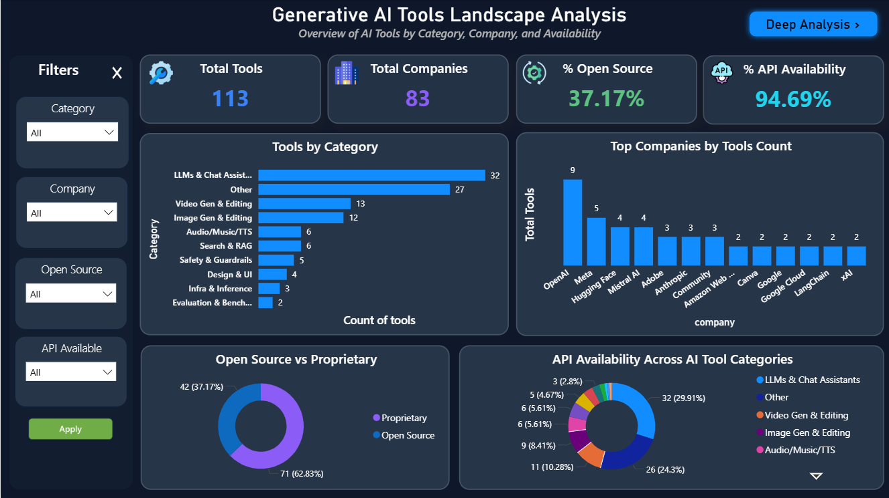
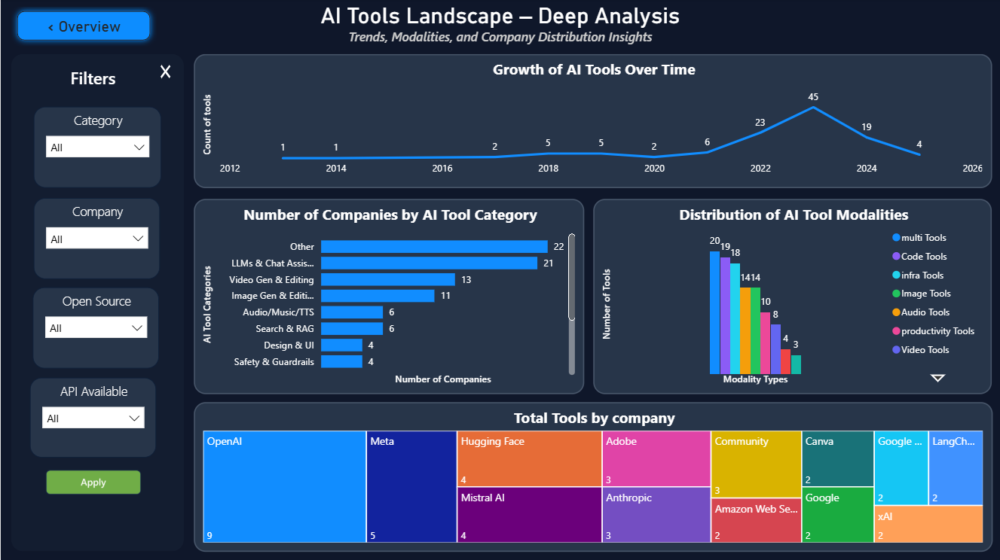
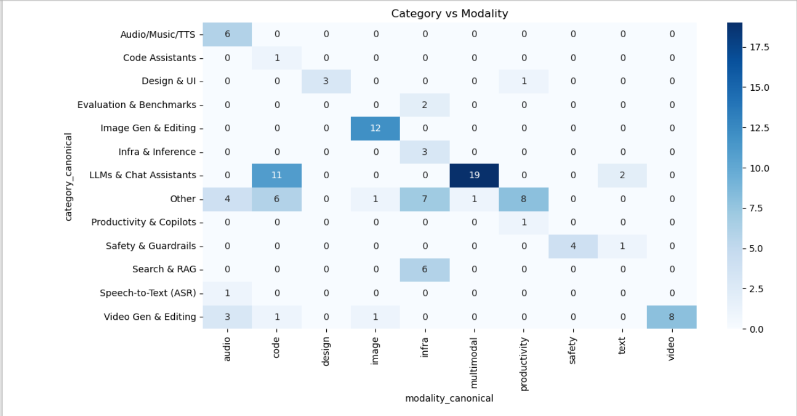
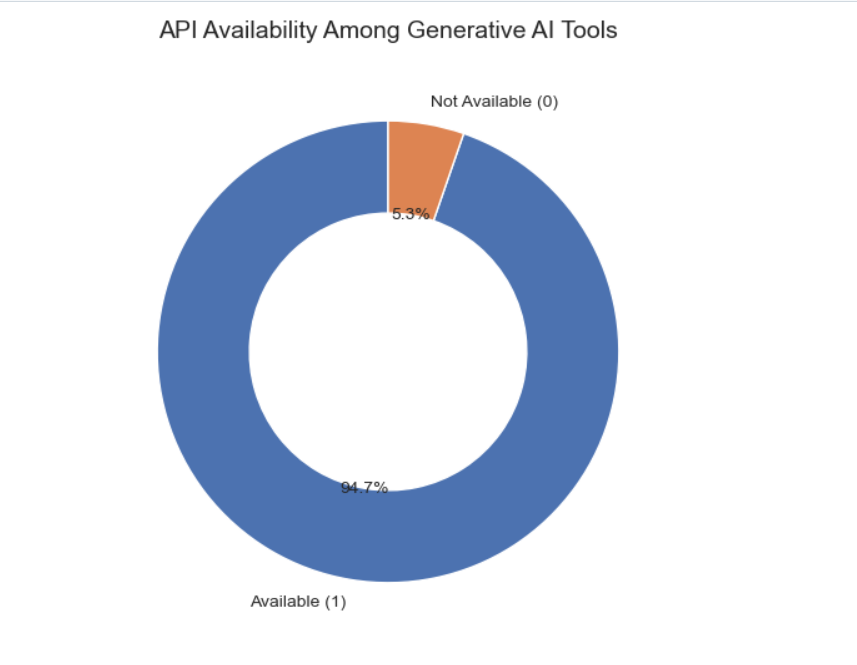
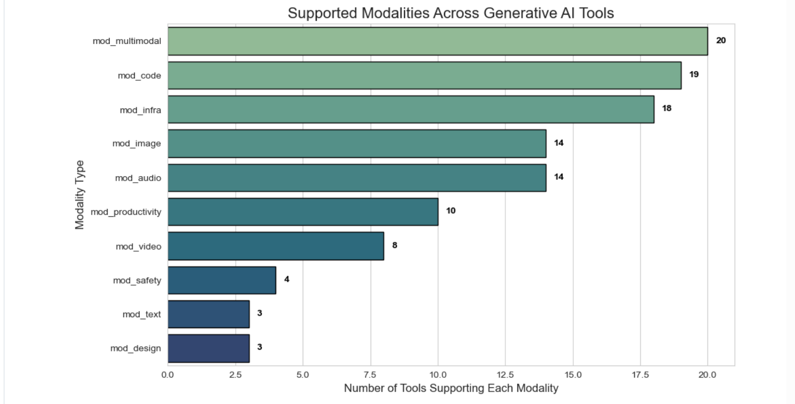
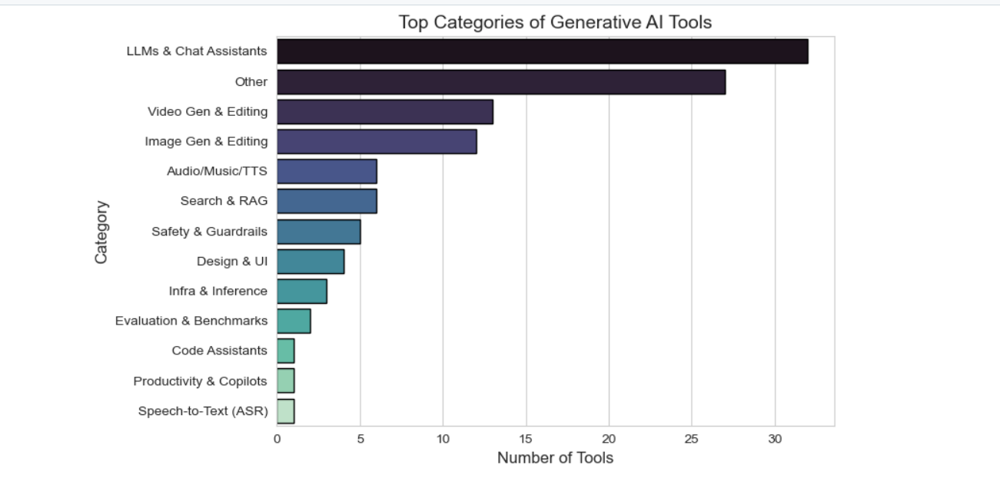

# 🧠 Generative AI Tools – Data Analysis & Dashboard

This project analyzes a dataset of Generative AI tools to uncover trends in categories, modalities, and API availability.

It is further enhanced with an **interactive Power BI dashboard**, enabling dynamic exploration of insights.

---

## 🎯 Objectives
- Identify dominant categories in the AI tools ecosystem
- Analyze distribution across modalities (Text, Image, Video, etc.)
- Evaluate API and open-source availability
- Provide actionable insights through visualization

---

## 📊 Project Components

### 🔹 1. Data Analysis (Python)
- Data cleaning using Pandas
- Exploratory Data Analysis (EDA)
- Visualizations using Matplotlib & Seaborn

### 🔹 2. Power BI Dashboard
- Interactive filtering by category and modality
- Visual breakdown of API availability
- Comparative insights across tool segments

---

## 📈 Key Insights
- ✅ Text-based tools dominate the market
- ✅ Multimodal tools are emerging but still limited
- ✅ High API availability indicates strong ecosystem maturity
- ✅ Open-source tools are fewer but innovation-driven

---

## 📊 Visualizations

### 🔹 Category vs Modality Heatmap
Shows relationships between tool categories and modalities.

### 🔹 API Availability Analysis
Highlights proportion of API-enabled tools.

### 🔹 Modality Distribution
Displays spread across text, image, video, etc.

### 🔹 Category Distribution
Identifies dominant and niche AI tool segments.

---
## 📊 Project Preview

### 🔹 Power BI Dashboard

#### Dashboard Overview


#### Data Analysis View


---

### 🔹 Key Data Analysis Visualizations

#### Category vs Modality Heatmap


#### API Availability Analysis


#### Modality Distribution


#### Category Distribution

---


## 🛠️ Tech Stack

| Tool            | Purpose                  |
|-----------------|--------------------------|
| Python          | Data analysis            |
| Pandas, NumPy   | Data processing          |
| Matplotlib      | Visualization            |
| Seaborn         | Advanced visualization   |
| Power BI        | Interactive dashboard    |
| Jupyter Notebook| Analysis environment     |

---

## 📁 Project Structure
```
Generative-AI-Tools-Analysis/
│
├── data/
├── notebooks/
│   └── Generative AI Tools.ipynb
├── dashboard/
│   └── ai tools dashboard.pbix
├── reports/
│   └── Generative_AI_Dashboard_Report.pdf
├── images/
│   ├── heatmap.png
│   ├── api_chart.png
│   ├── modality.png
│   └── category.png
└── README.md
```
## ▶️ How to Open the Dashboard

### 🔹 Option 1: Open in Power BI Desktop (Recommended)
1. Download and install Microsoft Power BI Desktop  
2. Clone or download this repository  
3. Go to the `dashboard/` folder  
4. Open the file:
---

## 🚀 Future Improvements
- Add time-based trend analysis
- Deploy dashboard via Power BI Service / Streamlit
- Expand dataset for broader insights
- Integrate real-time AI tool tracking

---

## 💡 Skills Demonstrated
- Data Cleaning & Preprocessing
- Exploratory Data Analysis (EDA)
- Data Visualization
- Business Intelligence (Power BI)
- Insight Generation

---

## 📫 Contact
- LinkedIn: https://linkedin.com/in/minnanourin  
- GitHub: https://github.com/MinnaNourin  

---
